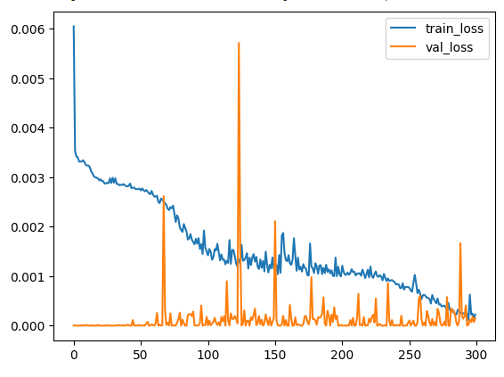

# Desafio_PS_IndustriALL
Esse Repositório é referente ao desafio do processo seletivo da IndustriALL

**Dono do Repositótio:** Rodolfo Franco Ribeiro

# Desafio:

Contratado por uma Startup especialista no desenvolvimento de soluções de
Inteligência Artificial para os mais diversos setores industriais. Papel é criar um modelo
preditivo utilizando dados dos sensores da planta para identificar padrões que precedem falhas
no equipamento.

# Objetivo:

O objetivo é criar um modelo preditivo que possa identificar antecipadamente as possíveis falhas de um equipamento em específico a partir dos valores dos demais sensores da planta. explorar, analisar e modelar os dados dos sensores para prever possíveis falhas no equipamento industrial. Isso envolve a preparação dos dados, identificação de padrões ou comportamentos anômalos que possam indicar falhas iminentes e a criação de um modelo preditivo capaz de prever essas falhas com uma boa precisão. 

# Dados Bruto do Desafio:

Os dados bruto do desafio consiste em uma pasta com 53 arquivo csv. Cada arquivo csv tem duas colunas: Uma coluna comum em todos os arquivo coluna "timestamp" referente a um minuto de medição dos sensores da planta, que começa do primeiro minuto do dia 01/04/2018 a ultimo minuto 31/08/2018. E outra coluna varia de arquivo a arquivo. Analisando os arquivos foi possível inferir que os arquivos  TAG_iALL_PS_00.csv, TAG_iALL_PS_01.csv, TAG_iALL_PS_02.csv, ..., TAG_iALL_PS_51.csv são as medições de algum sensor, ou seja, a entrada. E o arquivo target_iALL_PS.csv apresenta na sua coluna individual o estado da planta industrial: Normal ou Anormal, ou seja, a saída.

# Metodologia

Como os dados são com base no tempo vai ser criado um modelo RNN (Rede Neural Recorrente), a hipótese é que os tempos anteriores a um dado instante podem influênciar o estado da planta naquele instante. Para isso realizar um pré-processamento nos dados para atender ao modelo predetivo. 

# Códigos:

  - Importante
      + Para mexer nos código é preciso mexer no caminho da variavel path_of_PS_IndustriALL (str) presente em todos os códigos. É o caminho do diretório que foi colcado a respositório
  
  - Bibliotecas
    + sys, os, pandas, matplotlib, numpy, tensorflow e sklearn

  - Ambiente usado para o projeto
    + Google Colab

  - data_preprocessing.ipynb:
    + Objetivo: Realizar o tratamento dos dados
    + 1°: Carregar os arquivos csv dos Dados Brutos
    + 2°: Montar um único DataFrame/Tabela com esses Dados, sem repetir a coluna comum "timestamp", onde cada arquivo teria uma coluna no Dataframe/Tabela
        * Total de linhas/dados de 220320
        * Total de Coulnas: 54
    + 3°: Verificar se há arquivos com colunas iguais ou colunas com linhas vazias
        * Foi Removido TAG_iALL_PS_15, pois está com linhas vazias
        * Total de Coulnas: 53
    + 4° Verificação se há linhas duplicadas
    + 5° Remoção de linhas com pelo menos uma coluna/entrada vazias
        * 101217 dados/linhas removidos, sobrando 119103 dados
    + 6° Análise das saídas:
        * Duas classes: Normal (0) e Anormal (1)
        * 97,5% dos dados totais são da classe Normal e 2,5% são Anormal
        * Evidente um desbalanceamento dos dado    
    + 7° Análise das médias, desvio padrão, coeficiente de variação e dos histogramas de cada tipo de entrada/coluna
    + 8° Critérios para remover algumas colunas:
        * Coeficiente de variação (cv) abaixo da média dos coeficientes de variação menos o desvio padrão das entradas (menor que 27.4%)
        * Colunas que tem seus histogramas de classe (um histograma por classe - Normal e Anormal) com a área de intersecção maior ou igual a 75%
        * Entradas com esses critério tem baixa variação no tempo e pouco influência a saída
        * Colunas/Entradas Removidas: TAG_iALL_PS_20, TAG_iALL_PS_24, TAG_iALL_PS_25
    + 9° Escolha do minuto de previsão:
        * um minuto entre 30min a 480 min (8h, uma jornada de trabalho)
        * Com base na correlação médias das entradas com a saída
        * O escolhido é mais distante possível que tenha uma tolerancia de 5% em relação a maior média de correlação
        * Minuto esoclhido é 63 min antes de uma possível anormalidade
        * Remoção das Colunas com correlação a baixo da média das correlações das colunas do minuto 63 min
        * Colunas não removidas: TAG_iALL_PS_00, TAG_iALL_PS_04, TAG_iALL_PS_05, TAG_iALL_PS_06, TAG_iALL_PS_10, TAG_iALL_PS_11, TAG_iALL_PS_12, TAG_iALL_PS_13, TAG_iALL_PS_22, TAG_iALL_PS_23, TAG_iALL_PS_26, TAG_iALL_PS_28, TAG_iALL_PS_37, TAG_iALL_PS_48, TAG_iALL_PS_50, TAG_iALL_PS_51   

  - train_main_model.ipynb:

    + Objetivo: Realizar o treinamento do modelo preditivo com base nos dados pré-processados, que prever com 63 min de antecedência uma possível anormalia da planta.
    + Entradas: As linhas listadas no tópico 9° do data_preprocessing.ipynb mais o target_iALL_PS atual, totalizando 17 entradas
    + Perído de análise é de 10 min (ou seja 10 entradas para prever com 63 min de antecedência)
    + Divisão do Dataset: 80% Treino, 10% Validação e 10% Teste
    + Normalização dos dados
    + Arquiterura da rede RNN:
      * Camadas LSTM (Long Short Term Memory)
      * Função de ativação: Sigmoid, bom para problemas de classificações binárias
      * Função de perdas: MSE
      * Otimizador: ADAM
    + Uso da GPU
    + Hiperparamêtros de treinamento:
      * 300 épocas
      *  batch size de 32

# Resutados:

  + Treinamento, Gráfico da função de perdas ao longo das épocas:

    
  + Conclusão do Gráfico: É possível verificar que o modelo está no limite de chegar a um overfitting considerado, ainda não chegou. Realizar mais épocas de treinamento não recomendado, pois claramente está próximo de um overfitting. Além do mais nas ultimas épocas apresentou baixa perdas de treino e validação, isso é um bom sinal para a qualidade do modelo.  
  
  + Métrica de Avalição da acurácia Modelo:

    ° **Precisão:** Numero percentual da quantidade de Verdadeiro Positivos sobre o total de previsões. Ou seja, a taxa de acerto das previsões, sobre o conjunto de teste
    
| Classe | Precisão | Quantidade de Dados|
| ---    | ---      | ---|
| Todas | 97,5% | 11848|
| Normal | 98,8% |10265|
| Anormal | 89,3% |1583|

  ° Conclusão da Avaliação: Embora o modelo tenha alcançado uma boa precisão relativamente (97,3%) é necessário análisar os detalhes com mais cuidado. Por conta do desbaleciamento entre as classes (97,5% - 2,5%) a classe anormal apresentou baixa precisão, que é a classe foco do desafio, desse jeito é preciso de uma outra analise em conjunto para determinar a anormalia. Além disso como são poucos dados dessa classe não é um resultado tão confiante para generalizar. Desse modo, certas propostas podem melhorar ainda mais esse resultado ou ter mais confiabilidade, soluções como mais coleta de dados, data augmentation, criação de rede mais complexas (com mais camadas por exemplo) ou um pré- processamento de dados mais refinado.  

# Nova Proposta para o Desafio:

  + Criação de um outro modelo que prever quanto tempo (minutos) a anormalia vai continuar.
  + Motivação: É possivel analisar pelos dados que quando acontece uma anormalia não acontece em apenas 1 min, mas geralmente em periodo maior
  + Previsão acontece após a previsão do modelo principal (que prever quando que a anormalia acontece), que seria a previsão de quanto tempo a anormalia ia perpertuar

  + Pré-Processamento (feito em data_preprocessing.ipynb):
     * Criar a nova saída, que é o rastreamento temporal da anormalia da planta
     * Verificação da correlação, (entradas com correlação maior que média)
     * 16 entradas após pré-processamento
       
  + train_anomaly_time_model.ipynb (treinamento do novo modelo)
  + Perído de análise é de 10 min (ou seja 10 entradas para prever com 63 min de antecedência)
  + Divisão do Dataset: 80% Treino, 10% Validação e 10% Teste
  + Normalização dos dados
  + Arquiterura da rede RNN:
      * Camadas LSTM (Long Short Term Memory)
      * Função de ativação: ReLU, menor que 0 vira 0
      * Função de perdas: MSE
      * Otimizador: ADAM
  + Uso da GPU
    + Hiperparamêtros de treinamento:
      * 72 épocas
      *  batch size de 32

# Resultados da nova proposta:

  + Infelizmente deu erro e as perdas de treinamento eram constante
  + E erro só previsa uma saída (0)
  + Claramante um resultado não válido
  + Possível motivo pelo erro: Arquitetura da rede não adente a tal problemática

  
    

